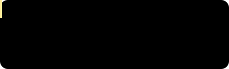

<!-- 🔗 Social / Links 社交链接 -->

---

## 👋 About Me | 关于我

- 🍋 Hi, I'm **Lemon** — living well, eating well, and learning well, one day at a time.
- 🍋 你好，我是 **Lemon** —— 目前正在好好生活、好好吃饭、好好学习中。
- 🔭 Currently working on: real-time rendering shaders & tooling
- 🔭 目前在做：实时渲染 Shader 与工具开发
- 🎯 2026 goal: ship a playable demo of my indie game
- 🎯 2026 目标：完成独立游戏 Demo

---

## 🌐 Homepage | 个人主页

> 🚧 My personal homepage is under construction — coming soon!
> 🚧 个人主页制作中，敬请期待！

- Preview link | 预览链接: [#](#)

---

## 💼 Connect with Me | 联系方式

| Platform 平台 | Link 链接 |
|---|---|
| 💼 LinkedIn | [Yimeng Gu](https://www.linkedin.com/in/yimeng-gu-a84b9a266) |
| 📮 Email 邮箱 | [gymyolanda@gmail.com](mailto:gymyolanda@gmail.com) |
| 💬 Discord | lemon002 |

---

## 🛠️ Skills | 技能

<!-- 可以用 https://skillicons.dev 生成图标，或保留下面的表情符号列表 -->
<!-- You can generate icons via https://skillicons.dev, or keep the emoji list below -->

**Languages 编程语言**
 `💻 C++` `🟨 GLSL` `🐍 Python` `☕ Java`

---

## 🎨 Hobbies & Interests | 兴趣爱好

- 🎮 ACG
- 🎮 游戏/动漫/小说
- 📸 Birding
- 📸 观鸟
- 🎵 Music — open to any genre
- 🎵 音乐 —— 什么风格都听
- ✈️ Travel — Yunnan, Northwest China & Jiangnan
- ✈️ 旅行 —— 云南/西北/江南

---

🍋 Thanks for visiting my profile — feel free to reach out!
🍋 感谢你的访问，欢迎随时联系我！

